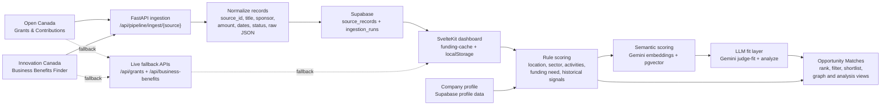

# Publicus Technical

Publicus Technical is the workspace for FundRadar, a Canadian funding discovery product. It combines a SvelteKit frontend, a FastAPI backend, Supabase auth and storage, and public Canadian funding datasets for grants, contributions, and business support programs.

The app is currently optimized for authenticated funding discovery: users build a company profile, browse government funding datasets, compare opportunity matches, and use optional AI-assisted profile and opportunity analysis when the relevant provider keys are configured.

## Current State

- Frontend: SvelteKit 2 app in `frontend/`, styled with Tailwind CSS 4.
- Backend: FastAPI package in `backend/publicus_backend/`.
- Auth and persistence: Supabase auth, profiles, company profiles, ingestion tables, and optional pgvector opportunity embeddings.
- Dataset sources:
  - Open Canada - Grants & Contributions.
  - Innovation Canada - Business Benefits Finder.
- Dashboard UX:
  - `/` is the public homepage.
  - `/dashboard` is the protected overview route.
  - All dashboard pages share a sidebar, topbar, global search, and responsive workspace shell.
  - Legacy top-level dashboard URLs redirect into `/dashboard/...`.
- Data loading:
  - The frontend prefers backend-ingested Supabase pipeline records.
  - If pipeline storage is unavailable or empty, it falls back to the live source APIs and browser cache.
- Security posture:
  - Dashboard routes require a Supabase session.
  - Ingestion routes require `PUBLICUS_PIPELINE_ADMIN_TOKEN`.
  - Service role keys stay server-side.
  - SvelteKit responses include conservative security headers and FastAPI CORS is allowlist-based.

## Project Layout

```text
.
├── .dockerignore
├── .env.example
├── .envrc
├── Dockerfile
├── docker/
│   └── start.sh
├── flake.nix
├── supabase/
│   └── migrations/
│       ├── 20260427000000_create_profiles.sql
│       ├── 20260427001000_create_company_profiles.sql
│       ├── 20260427002000_harden_profile_constraints.sql
│       ├── 20260427003000_add_opportunity_embeddings.sql
│       └── 20260427004000_create_ingestion_tables.sql
├── backend/
│   ├── main.py
│   ├── open_canada_grants_scraper.py
│   ├── pyproject.toml
│   └── publicus_backend/
│       ├── app.py
│       ├── routers/
│       │   ├── business_benefits.py
│       │   ├── grants.py
│       │   ├── health.py
│       │   ├── innovation.py
│       │   ├── opportunities.py
│       │   ├── pipeline.py
│       │   ├── profile_copilot.py
│       │   └── search.py
│       └── services/
│           ├── business_benefits.py
│           ├── embeddings.py
│           ├── grants.py
│           ├── innovation.py
│           ├── opportunity_analysis.py
│           ├── pipeline.py
│           ├── profile_copilot.py
│           └── semantic_search.py
└── frontend/
    ├── package.json
    └── src/
        ├── hooks.server.ts
        ├── lib/
        │   ├── DashboardSearch.svelte
        │   ├── OpportunityForceGraph.svelte
        │   ├── WorkspaceSidebar.svelte
        │   ├── WorkspaceTopbar.svelte
        │   ├── client/
        │   └── server/
        └── routes/
            ├── +page.svelte
            ├── login/
            ├── signup/
            ├── logout/
            ├── auth/callback/
            └── dashboard/
```

## Development Setup

Enter the dev shell:

```bash
direnv allow .
# or
nix develop
```

The flake dev shell provides Node.js, Python, uv, FastAPI, Uvicorn, Pydantic, HTTPX, pytest, Chromium on Linux for rendered source scraping, direnv, git, nil, and nixfmt.

Install frontend dependencies when needed:

```bash
npm --prefix frontend install
```

Run the backend:

```bash
uvicorn main:app --app-dir backend --host 0.0.0.0 --port 8000 --reload
```

Run the frontend:

```bash
npm --prefix frontend run dev -- --host 0.0.0.0
```

The frontend uses same-origin `/api/...` URLs by default. In local development, SvelteKit proxies those requests to the FastAPI server at `http://127.0.0.1:8000`.

## Docker and Coolify

The repository includes a root `Dockerfile` for Coolify. It builds the SvelteKit app, installs the FastAPI backend dependencies, and runs both services in one container:

- SvelteKit listens on `PORT`, default `3000`.
- FastAPI listens internally on `127.0.0.1:${BACKEND_PORT}`, default `8000`.
- Browser requests to `/api/...` are handled by SvelteKit and proxied to FastAPI through `INTERNAL_BACKEND_API_URL`.

Coolify setup:

1. Create a new application from the Git repository.
2. Choose Dockerfile build mode and use the root `Dockerfile`.
3. Expose port `3000`.
4. Set the required environment variables from `.env.example`, especially Supabase auth values.
5. Leave `PUBLIC_BACKEND_API_URL` empty unless the backend is deployed on a separate public domain.

Local Docker build:

```bash
docker build -t fundradar .
docker run --rm -p 3000:3000 --env-file .env fundradar
```

If you deploy the frontend and backend separately, set `PUBLIC_BACKEND_API_URL` to the public backend origin and `INTERNAL_BACKEND_API_URL` or `BACKEND_API_URL` to the internal FastAPI origin.

## Environment

Copy the root example file and fill in local values:

```bash
cp .env.example .env
direnv allow .
```

The root `.env` is loaded by `.envrc`, so frontend and backend commands run from this repo receive the same variables. SvelteKit and Vite are configured to read the root `.env`.

Required for auth:

```bash
PUBLIC_SUPABASE_URL=
PUBLIC_SUPABASE_PUBLISHABLE_KEY=
```

Common backend and pipeline variables:

```bash
PUBLIC_BACKEND_API_URL=
BACKEND_API_URL=http://127.0.0.1:8000
INTERNAL_BACKEND_API_URL=http://127.0.0.1:8000
PUBLICUS_CORS_ORIGINS=http://localhost:5173,http://127.0.0.1:5173
SUPABASE_URL=
SUPABASE_SERVICE_ROLE_KEY=
PUBLICUS_PIPELINE_ADMIN_TOKEN=
```

Optional AI and embedding variables:

```bash
PUBLICUS_EMBEDDING_PROVIDER=google
PUBLICUS_EMBEDDING_DIMENSIONS=1536
PUBLICUS_GOOGLE_EMBEDDING_MODEL=gemini-embedding-001
PUBLICUS_GOOGLE_EMBEDDING_BATCH_SIZE=100
PUBLICUS_GOOGLE_EMBEDDING_TASK_TYPE=SEMANTIC_SIMILARITY
GEMINI_API_KEY=
PUBLICUS_GEMINI_GENERATION_MODEL=gemini-3-flash-preview
```

`GOOGLE_API_KEY` and `GOOGLE_GENERATIVE_AI_API_KEY` are also accepted by the backend. An OpenAI embedding fallback can be enabled with:

```bash
PUBLICUS_EMBEDDING_PROVIDER=openai
OPENAI_API_KEY=
```

Do not expose `SUPABASE_SERVICE_ROLE_KEY` in browser code. It is only for FastAPI pipeline writes, pipeline reads, semantic search, and pgvector caching.

## Frontend Routes

Public routes:

```text
/                  FundRadar homepage
/login             Supabase email/password login
/signup            Account creation
/auth/callback     Supabase auth callback
/logout            Sign out endpoint
```

Protected dashboard routes:

```text
/dashboard                                  Overview
/dashboard/grants-contributions             Open Canada grants and contributions
/dashboard/business-benefits-finder         Innovation Canada business benefits
/dashboard/live-view                        Combined live dataset view
/dashboard/persona                          Company profile matching workflow
/dashboard/persona/matches                  Matched opportunity results
/dashboard/graph-view                       Opportunity relationship graph
/dashboard/profile                          Company profile builder
/dashboard/settings                         Account and workspace settings
```

Legacy route redirects:

```text
/business-benefits-finder -> /dashboard/business-benefits-finder
/grants-contributions     -> /dashboard/grants-contributions
/live-view                -> /dashboard/live-view
/persona                  -> /dashboard/persona
/persona/matches          -> /dashboard/persona/matches
/profile                  -> /dashboard/profile
/settings                 -> /dashboard/settings
/company                  -> /dashboard/persona
```

Dashboard protection is enforced in `frontend/src/hooks.server.ts` with `safeGetSession()`. Unauthenticated users are redirected to `/login?next=...`.

## Backend API

The FastAPI app is created in `backend/publicus_backend/app.py`.

Router summary:

- `routers/grants.py`: Open Canada Grants & Contributions.
- `routers/business_benefits.py`: Innovation Canada Business Benefits Finder.
- `routers/innovation.py`: legacy Innovation Canada route compatibility.
- `routers/search.py`: semantic scoring and index search.
- `routers/opportunities.py`: opportunity analysis and fit judging.
- `routers/profile_copilot.py`: company profile extraction assistance.
- `routers/pipeline.py`: Supabase-backed source ingestion and pipeline reads.
- `routers/health.py`: health check.

Useful endpoints:

```text
GET  /health
GET  /api/grants
GET  /api/grants/discover
GET  /api/grants/resources
GET  /api/grants/csv-url
GET  /api/grants/first/{count}
GET  /api/grants/by-calendar-year/{year}
GET  /api/grants/by-reference/{ref_number}
POST /api/grants/export
GET  /api/grants/export/{task_id}
GET  /api/business-benefits/first/{count}
GET  /api/business-benefits/update-feed
GET  /api/business-benefits/by-category
GET  /api/business-benefits/by-category/{category}
GET  /api/innovation/first/{count}
GET  /api/innovation/update-feed
GET  /api/innovation/by-category
GET  /api/innovation/by-category/{category}
POST /api/search/semantic
POST /api/search/semantic/index
POST /api/opportunities/analyze
POST /api/opportunities/judge-fit
POST /api/company-profile/copilot/extract
GET  /api/pipeline/status
GET  /api/pipeline/records
POST /api/pipeline/ingest/{source}
```

Fast grant query example:

```bash
curl -G 'http://127.0.0.1:8000/api/grants' \
  --data-urlencode 'year=2024' \
  --data-urlencode 'limit=25' \
  --data-urlencode 'sort=amount' \
  --data-urlencode 'include_total=false'
```

Pipeline query example:

```bash
curl 'http://127.0.0.1:8000/api/pipeline/records?source=grants&limit=25'
```

Pipeline ingest example:

```bash
curl -X POST \
  -H "x-publicus-admin-token: $PUBLICUS_PIPELINE_ADMIN_TOKEN" \
  'http://127.0.0.1:8000/api/pipeline/ingest/grants?max_records=1000'
```

## Data Pipeline Overview

FundRadar has two read paths for funding data:

1. Pipeline-first reads from normalized Supabase `source_records`.
2. Live fallback reads from the original public source APIs plus browser cache.

This keeps the dashboard usable before the ingestion tables are configured, while giving production deployments a faster and more consistent storage path.



### Sources

Open Canada - Grants & Contributions:

- Search page: `https://search.open.canada.ca/grants/`
- CKAN package: `432527ab-7aac-45b5-81d6-7597107a7013`
- Main datastore resource: `1d15a62f-5656-49ad-8c88-f40ce689d831`
- Content: historical grant and contribution awards, recipients, programs, departments, agreement dates, amounts, and locations.

Innovation Canada - Business Benefits Finder:

- CKAN package: `4e75337e-70d0-4ed7-92d1-3b85192ec6b1`
- Content: current business support programs, benefit titles, descriptions, departments, links, and related eligibility metadata.
- The backend downloads the latest XLSX resource and parses it with Python ZIP/XML tools. Category views can use Chromium because the official rendered page exposes category labels that are not present in the XLSX feed.

### Ingestion

The ingestion service is implemented in `backend/publicus_backend/services/pipeline.py`.

The admin ingest endpoint:

```text
POST /api/pipeline/ingest/grants
POST /api/pipeline/ingest/business-benefits
```

Ingestion flow:

1. Validate `PUBLICUS_PIPELINE_ADMIN_TOKEN`.
2. Create an `ingestion_runs` row with status `running`.
3. Fetch source records from the source-specific service.
4. Normalize each record into shared fields such as `source`, `source_id`, `title`, `sponsor`, `description`, `province`, `city`, `amount`, dates, `status`, `is_active`, and `content_hash`.
5. Store the untouched source payload in `raw_record` JSONB.
6. Upsert by `(source, source_id)` into `source_records`.
7. Mark the run as `succeeded` or `failed` with counts and error details.

Current safety limits:

- Query limit: `5000`
- Ingest limit: `25000`
- Default ingest size: `1000`

The pipeline only deactivates records that disappear from a full snapshot. Partial ingests avoid deactivation so test runs do not incorrectly hide live records.

### Storage Schema

Pipeline tables are created by:

```text
supabase/migrations/20260427004000_create_ingestion_tables.sql
```

Core tables:

- `ingestion_runs`: source, status, started/completed timestamps, record counts, metadata, and error message.
- `source_records`: normalized searchable fields, source metadata, raw JSONB record, content hash, activity state, and fetched timestamp.

The schema includes indexes for source, activity state, titles, sponsors, dates, amount, fetched time, and raw JSONB lookups. Public read policies are enabled for dashboard reads, while writes are expected through the backend service role key.

### Frontend Read Path

Shared dataset loading is implemented in:

```text
frontend/src/lib/client/funding-cache.ts
```

Read flow:

1. Request `/api/pipeline/records?source=...&limit=...`.
2. If the pipeline returns records, use them.
3. If the pipeline is unavailable, not migrated, empty, or returns a non-OK response, fall back to:
   - `/api/grants?...`
   - `/api/business-benefits/first/{count}`
4. Cache successful results in browser `localStorage`.
5. Hydrate cached records immediately on repeat visits and refresh in the background.

This means local development can still work without migrated pipeline tables, while deployed environments can serve normalized records from Supabase.

### Matching and Analysis

Company profile data is stored in Supabase and used by dashboard matching views.

Current matching layers:

- Browser-side rule scoring ranks records by profile attributes such as region, industry, goals, and company metadata.
- `/api/search/semantic` can blend rule scores with embedding similarity when embeddings are configured.
- `/api/search/semantic/index` can search cached pgvector opportunity embeddings.
- `/api/opportunities/analyze` and `/api/opportunities/judge-fit` use Gemini generation when configured.
- `/api/company-profile/copilot/extract` can turn profile interview answers into structured company profile fields.

When AI providers are not configured, the core dashboard and source browsing still work; AI-specific endpoints return availability errors.

### Operations

Pipeline status:

```bash
curl 'http://127.0.0.1:8000/api/pipeline/status'
```

Manual ingest:

```bash
curl -X POST \
  -H "x-publicus-admin-token: $PUBLICUS_PIPELINE_ADMIN_TOKEN" \
  'http://127.0.0.1:8000/api/pipeline/ingest/business-benefits?max_records=1000'
```

The pipeline does not include a scheduler yet. For production, trigger these ingest endpoints from a deployment cron, scheduled job, or CI workflow with the admin token stored as a secret.

If `/api/pipeline/status` returns `503`, check that `SUPABASE_URL`, `SUPABASE_SERVICE_ROLE_KEY`, and the Supabase migrations are applied.

## Scraper CLI

The grants scraper can be run directly:

```bash
python backend/open_canada_grants_scraper.py discover
python backend/open_canada_grants_scraper.py dump --max-records 100 --output backend/data/grants.sample.jsonl
python backend/open_canada_grants_scraper.py dump --format csv --max-records 100 --output backend/data/grants.sample.csv
```

The full grants CSV is over 2 GB, so prefer streaming datastore dump commands unless the raw CSV is explicitly needed.

## Verification

Recommended checks:

```bash
nix develop -c npm --prefix frontend run check
nix develop -c npm --prefix frontend run build
nix develop -c python -m compileall -q backend/publicus_backend backend/main.py backend/open_canada_grants_scraper.py
nix develop -c python -m pytest backend/tests
nix flake check
```

For documentation-only changes, a text sanity check is usually enough. For route, API, pipeline, or schema changes, run the relevant frontend, backend, and migration checks above.

## Operational Notes

- Keep `SUPABASE_SERVICE_ROLE_KEY` and `PUBLICUS_PIPELINE_ADMIN_TOKEN` out of client-side code and version control.
- Apply Supabase migrations before relying on pipeline reads.
- CORS origins are controlled by `PUBLICUS_CORS_ORIGINS`.
- Dashboard route protection depends on valid Supabase auth configuration.
- The live source APIs are public and can be slow or temporarily unavailable, so the Supabase pipeline should be used for production-like deployments.
- This is an active technical workspace, not a finalized production deployment.
